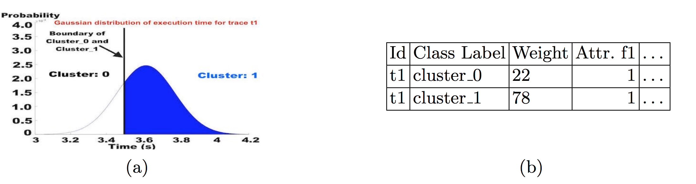
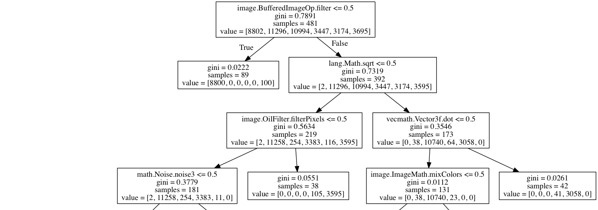

# Discriminer: Discriminating traces with Time

## Description
Dicriminer is a combination of dynamic analysis and machine learning techniques which helps users to learn a discriminant model about program trace based on external observation. [First](https://github.com/cuplv/Discriminer/blob/master/README.md#Data-Extraction-(program-internal-and-observations)), a program is analyzed and a data set of the program behaviors is obtained using dynamic instrumentation techniques. The data set features can be function calls, basic block, branches and other internal program features. In addition, the data set should include an observable feature like time of execution or network packet information for each record (each record of data is equal to some features of a program trace). Note that due to probabilistic modeling, the data should include 10 times of observations for the same record, or it may include mean and standard deviation for each record. [In the next step](https://github.com/cuplv/Discriminer/blob/master/README.md#data-clustering-label-and-weight-calculations), given this data as input, the clustering part will divide the data into numbers of clusters (specified by the user) based on distance measures like euclidean distance using the mean of each record. As a result, each record is assigned to a class label based on a range of execution time. The clustering procedure considers a stochastic distribution for each observation, and it calculates a probability (weight) to be assigned to different clusters. For example, suppose **t1** is a trace which has time observation such that the mean of execution time is 3.6 seconds and standard deviation is 161 as follow:

The clustering based on mean will assign it to both Cluster_1 and Cluster_0 with different weights 78 and 22, respectively. This is due to probabilistic behaviors of time (we consider time as a Guassian Distibution). The output data of clustering step will include the internal features of the program, class label (assigned cluster), and weight for each record. This data will be input for classification step ([final step](https://github.com/cuplv/Discriminer/blob/master/README.md#learning-classifier)). A classifier model like decision tree will learn a model which discriminates traces. As each label is equal to a cluster (for example a time range of execution), the classifier distinguishes traces based on the observations. If the inside features are function calls, for instance, the classifier will learn a model which explains timing differences based on function calls. The discriminant model can be useful to debug security issues related to timing side channel and availability as shwon in "Discriminating Traces with Time" appeared in TACAS'17. We consider an example of SnapBuddy in the paper to show different stpes of Discriminer. 
### Steps: [1. Data Extraction](https://github.com/cuplv/Discriminer/blob/master/README.md#data-extraction) -> [2. Data Clustering](https://github.com/cuplv/Discriminer/blob/master/README.md#data-clustering-label-and-weight-calculations) -> [3. Learning Classifier](https://github.com/cuplv/Discriminer/blob/master/README.md#learning-classifier)

#### Requirement:
Python 2.7 or more  
Libraries: Numpy, Pandas, matplotlib, sklearn, and scipy  

## SnapBuddy Social Web Server
SnapBuddy is a java web application with 3,071 methods. It is implementing a mock social network in which each user has their own page with a photograph. Users can login to SnapBuddy to upload photos to share 
with their friends. In addition to uploading photos, users can apply filters to their photos to change how they
look. Finally, users are able to have the server tell them their current location. To run SnapBuddy webserver while you are at the root of the Git repository, issue ./SnapBuddy/run.sh command, and once the
server is started the script will output "Server started on port 8080". Users can sign in to the login page: https://localhost:8080/login and log in with valid credentials. An example user is provided as following Username: devenmartinez@hotmail.com; Password: PS1Ljv4NPs.

## Data Extraction (program internal and observations)
The format of the data set file should be **.csv**. In order to extract the data set from a target program, we use Java Agent and Javassistant. Java Agent is used to intercept java byte-code at run-time, and Javassistant is used to manipulate java byte-code. The implemented java instrumentation for recording call can be found in the form of MAVEN project inside **callRecord**. To obtian the data set for SnapBuddy appliction, you need to run following command while you are at the root of Git repository:   
\# cd SnapBuddy    
\# ./start.sh     
This script will execute both instrumented (to record method calls) and un-instrumented (to measure execution time) versions of the SnapBuddy application with the same set of inputs, but separately. It may take 2-3 hours to build the data set of SnapBuddy users' public profile. This process will generate three .csv files as following: 1- **result_time.csv** which is 10-times of execution time measurements to download public profile page of each user in the SnapBuddy. 2- **results_raw_data_results.txt.csv** which is program method calls during downloading the public profile page of each user. 3- **final_result.csv** which merges the execution time observations with the corresponding internal method calls. 
The data set named final_result.csv will be used for the clustering and classification steps. In general, clustering and classification steps require a set of internal features (like method calls or predicate conditions) as variable and either 10-times of observations (explicitely named T1 to T10 in .csv file) or mean and standard deviation of each observation (explicitely named mean and std in .csv file) to find similarity between the records and builds discriminant model. 
You can use the same script for all other applications and micro-benchmark to produce the data set. For micro-benchmark you need to specify the name of the application available at ./MicroBenchmark/Available_Benchmarks.txt. Let's suppose you choose LSB0_10_100_10, you need to issue following commands:   
\# cd MicroBenchmark    
\# ./start.sh LSB0_10_100_10   
Let's come back to SnapBuddy application. The sample of output file is available inside **Output_Sample**. Once you obtain the data set (or use the provided one inside **Output_Sample**), you need to move it to inside of **Clustering_input** to organize the data set in different steps. 

## Data Clustering (label and weight calculations)
After putting data inside **Clustering_input**, you can run **Cluster.py** to cluster data and calculate required features for classification step. The program asks users about the name of the input file, whether the data set included 10-times measurements **"T1"**...**"T10"** or it contains **"mean"** and **"std"**, number of clusters, and the output of clustering step. Considering the example of SnapBuddy, you need to issue following commands to cluster the data set while you are at the root of Gut repository (Let's suppose we change the name of **final_result.csv** to **data_snapBuddy1.csv**):  
\# python Cluster.py --filename Clustering_input/data_snapBuddy1.csv --measurements yes --clusters 6 --output ./Clustering_results/cluster_result_snapBuddy1   
--filename (specifies the input data set for clustering)  
--measurements  ('yes' if the data set include 10-times of measurements; 'no' if the data set has mean and standard deviation)   
--clusters (specifis number of desired clusters)  
--output (specifies the name and location of output file)  

The following is the result of clustering plot for SnapBuddy (axis y is mean of execution time and axis x is user ID): 
  
The plot shows data clustering based on the mean measurement of each record. After calculating the clusters based on mean, the clustering program calculates boundaries between clusters. The boundaries are calculated as follow: first, it sorts all data inside different clusters. Then, it picks the maximum value of cluster n and the minimum value of cluster n+1. The boundary line is the average of these two numbers. In the case of **t1** as shown earlier in [Description] (https://github.com/cuplv/Discriminer/blob/master/README.md#Description), the boundary line between cluster_0 and cluster_1 is about 3.5 seconds. Considering the measurement (like time) is normal random variable, we calculate the probability of a record to assign all clusters. For this aim, we calculate **Cumulative distribution function** of normal distribution in every cluster boundaries. For example, cfd of t1 is 0.78 to be assigned to Cluster_1 and 0.22 in the case of Cluster_0. So, t1 will replicate two times with the same ID. One labeled Clsuter_0  (weighted 22) and the another labeled Cluster_1 (weighted 78). The rest of the features will be the same for both of them. In this fashion, the output of clustering procedure will be calculated and the result will be input for classification step. The output file should go into **Clustering_results** in **.csv** format. In this example, the output file will be **Clustering_results/cluster_result_snapBuddy1.csv**. 

## Learning Classifier
The classification procedure considers input file to be inside **Classification_input**. For snapBuddy example, you can issue the following command to copy the result of clustering step inside the foloder as follow:  
\# cp ./Clustering_results/cluster_result_snapBuddy1.csv ./Classification_input/  
Then, we can run classification program as following:  
\# python Classify.py --filename ./Classification_input/cluster_result_snapBuddy1.csv --kfolds 20 --output ./Classification_results/snapBuddy1_decisionTree  
--filename (specifies the input data set for classification)  
--kfold (specifies K in K-fold cross_validationm it is optional)   
--depth (the maximum depth of tree, it is optional) 
--output (specifies the name and location of output file)  
The output file will produce three top accurate decision trees in **.dot** format inside **Classification_results** and print out the accuracy of each tree at the end of program execution. Users can enter the following command in terminal to produce final trees:  
dot -Tpng Classification_results/snapBuddy1_decisionTree_tree0.dot -o Classification_results/snapBuddy1_decisionTree_tree0.png  
And the result decision tree will look like the following (partial decision tree, see the full one inside **Classification_results**): 
  
Please note that we also use [RapidMiner[(https://rapidminer.com/) to produce the output decision tree in high quality. 
The decision tree can be seen as a set of discrimination formulae. For example, it says that if **"image.BufferedImageOp.filter"** is not called, then the record belongs to Cluster_0 (As it has much more samples in comparison to other clusters). The another example is the one which assigns records to last cluster namely Cluster_5. If **"image.BufferedImageOp.filter"** and **"image.OilFilterPixel"** are called, while **"lang.Math.sqrt"** is not called, then the data record should be assigned to Cluster_5. 
